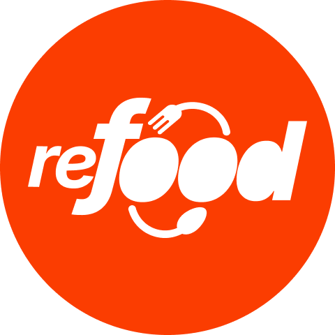

<div align="center" style="margin-top:20px; margin-bottom:20px;">

<br />

</div>

## Índice

- [Índice](#índice)
- [📌Sobre](#sobre)
- [👨‍💻Integrantes](#integrantes)
- [🚀Tecnologias utilizadas](#tecnologias-utilizadas)
- [Tecnologias](#tecnologias)
- [Funcionalidades](#funcionalidades)
- [🎨Cores](#cores)
- [💻O projeto pode ser vizualizado acessando o seguinte link](#o-projeto-pode-ser-vizualizado-acessando-o-seguinte-link)
- [👀Exemplo](#exemplo)
- [Como executar o projeto](#como-executar-o-projeto)
- [Estrutura de pastas](#estrutura-de-pastas)

<div id="sobre">

## 📌Sobre

**Refood** é uma plataforma onde estabelecimentos comerciais podem vender produtos próximos da data de validade a preços mais acessíveis, permitindo que consumidores adquiram esses itens e contribuam para a redução do desperdício de alimentos.

</div>

<div id="integrantes">

## 👨‍💻Integrantes

| [<br>Caio Martins](https://github.com/CaioMMendes) | [<br>Felipe Fracasso](https://github.com/FelipeM-F) | [<br>Leonardo Boeira](https://github.com/leomaciel14) | [<br>Marina Barbosa](https://github.com/marina-barbosa) | [<br>Ricardo Muenchen](https://github.com/RicardoDM23) | [<br>Samilis Brito](https://github.com/SamilisBrito) | [<br>Thasyo Peres](https://github.com/Thasyo) | [<br>Yasmin Carlôto](https://github.com/Yasmin-Carloto) |
| --- | --- | --- | --- | --- | --- | --- | --- |

</div>

</div>

<div id="tecnologias">

## 🚀Tecnologias utilizadas

## Tecnologias

- Vite
- Tailwind
- Prettier-tailwind - Plugin para organizar as classes do tailwind
- Zod - Validação
- Axios - Requisição
- React-hook-form - Formulário
- Zustand - Variavel global (tipo context)
- Icones - (react icons - phospor icons - lucide)
- Toast message - (react toastify - sonner)
- React-number-format - Mascara de input
- Framer Motion - Animação
- Swiper js - Slide
- Chart Js - Grafico
- Faker Js - Dados fakes
O projeto foi desenvolvido utilizando as seguintes tecnologias:

[](https://vite.dev/)
[](https://developer.mozilla.org/pt-BR/docs/Web/JavaScript)
[](https://tailwindcss.com/)
[](https://ui.shadcn.com/)

- [Next](https://nextjs.org/)
- [Typescript](https://www.typescriptlang.org/)
- [NextAuth](https://next-auth.js.org/)
- [Stripe](https://stripe.com/br?utm_campaign=BR_en_Search_Brand_Brand_EXA-15088005049&utm_medium=cpc&utm_source=google&ad_content=603963803239&utm_term=stripe&utm_matchtype=e&utm_adposition=&utm_device=c&gclid=CjwKCAiAgeeqBhBAEiwAoDDhn-uFC7kxKBhv1mdhEDV3YF4t4_p4CPb-thEMXqIVVWYa3wJBK0KwchoCu-cQAvD_BwE)
- [Tailwindcss](https://tailwindcss.com/)
- [Shadcn](https://ui.shadcn.com/)
- [React Hook Form](https://www.react-hook-form.com/)
- [React Query](https://tanstack.com/query/v3/)
- [Zod](https://zod.dev/)
- [Zustand](https://zustand-demo.pmnd.rs/)
- [Keen-Slider](https://keen-slider.io/)

</div>

<div id="funcionalidades">

## Funcionalidades

escrever as funcionalidades

</div>

<div id="cores">

## 🎨Cores

| Cor            | Hex                                                                   |
| ---------------- | --------------------------------------------------------------------- |
| Primary Color    |  #4f32c3 |
| Accent Color     |  #171717 |
| Background Color |  #0a0a0a |

</div>

<div id="linkdeploy">

## 💻O projeto pode ser vizualizado acessando o seguinte link

<https://refoodproject.vercel.app/>

</div>

<div id="exemplo">

## 👀Exemplo


</div>

<div id="comoexecutar">

## Como executar o projeto

Escrever como executar localmente

</div>

## Estrutura de pastas

```plaintext
src/
├── domains/                       # Domínios principais da aplicação
│   ├── food/                      # Domínio relacionado aos alimentos
│   │   ├── components/            # Componentes UI específicos do domínio
│   │   ├── models/                # Modelos de dados (e.g., Food, Category)
│   │   ├── services/              # Serviços de regras de negócio (lógica de domínio)
│   │   ├── hooks/                 # Hooks específicos do domínio
│   │   └── index.ts               # Exportações do domínio
│   ├── user/                      # Domínio relacionado aos usuários
│   │   ├── components/
│   │   ├── models/
│   │   ├── services/
│   │   ├── hooks/
│   │   └── index.ts
│   └── ...                        # Outros domínios (e.g., order, payment, etc.)
│
├── app/                           # Lógica e configuração geral da aplicação
│   ├── context/                   # Contextos globais (e.g., AuthContext)
│   ├── hooks/                     # Hooks reutilizáveis
│   ├── providers/                 # Providers globais (e.g., ThemeProvider)
│   ├── router/                    # Configuração de rotas
│   ├── store/                     # Gerenciamento de estado (e.g., Redux, Zustand)
│   └── App.tsx                    # Componente principal da aplicação
│
├── infrastructure/                # Infraestrutura e integrações externas
│   ├── api/                       # Configuração de APIs externas
│   ├── config/                    # Configurações globais (e.g., env, axios)
│   ├── logging/                   # Configuração de logs
│   └── security/                  # Configuração de segurança (e.g., autenticação)
│
├── ui/                            # Componentes de UI e estilos
│   ├── components/                # Componentes reutilizáveis de UI
│   ├── layouts/                   # Layouts globais
│   ├── styles/                    # Arquivos de estilo (e.g., Tailwind, CSS Modules)
│   └── assets/                    # Imagens, fontes, etc.
│
└── index.tsx                      # Entrada principal da aplicação React
```

Explicação
Domains: Cada domínio representa uma área do negócio (como food ou user) e contém tudo relacionado a ele, como componentes específicos, modelos de dados, serviços (regra de negócio), e hooks. Isso organiza o código de maneira modular e alinhada com as regras de negócio.

App: Contém a configuração e lógica geral da aplicação, como contextos, hooks globais, provedores e roteamento. Mantém a lógica de domínio separada das configurações e funcionalidades compartilhadas.

Infrastructure: Reúne todas as integrações externas e configurações de infraestrutura, como APIs, segurança, e logging. Mantém a lógica de domínio desacoplada de detalhes técnicos.

UI: Foca nos componentes de interface, layouts, estilos e ativos visuais. Essa separação permite que o desenvolvimento da UI seja independente das regras de negócio.
